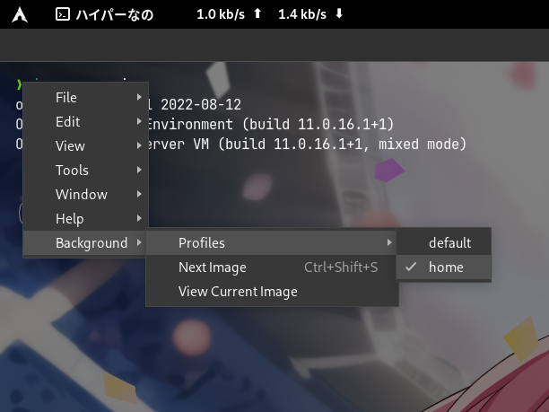

# hyper-random-background

Set background with random images every time interval.

## Install

```shell
npm i hyper-random-background
```

## Dependencies

`image-size`

This script is tested only on Linux, so performance is not guaranteed on Windows or MacOS.

## Usage

Add config to `~/.hyper.js`, and here is an example:

```javascript
module.exports = {
  ...
  config: {
    ...
    // It is recommended to add transparency to default backgroundColor
    backgroundColor: 'rgba(0, 0, 0, 0.9)',
    ...
    backgroundImage: {
      default: "default",
      profiles: {
        none: {}, // Option for no backgrounds
        default: {
          path: "/path/to/your/directory",
          overlayColor: "rgba(0, 0, 0, 0.7)",
          interval: 600,
          fade: true,
          blur: "5px",
          switchBackgroundKey: "CmdOrCtrl+Shift+S",
        },
        home: {
          path: "/path/to/your/config/list",
          overlayColor: "rgba(0, 0, 0, 0.5)",
          interval: 10,
          fade: false,
          blur: "0px",
          switchBackgroundKey: "CmdOrCtrl+Shift+B",
        },
      }
    },
  },
  ...
  plugins: [
    ...
    "hyper-random-background",
  ],
  ...
}
```

You can use multiple background profiles. To achieve this, you can add field in `backgroundImage.profiles` with key as the name you want to display, and value as config of the profile. Then set `backgroundImage.default` with the default profile key you want to use. A profile contains following fields:

|Key|Value|
|--- |--- |
|`path`|Path to directory or config file|
|`overlayColor`|Overlay color in front of the image, default: `"rgba(0, 0, 0, 0.7)"`|
|`interval`|Time interval in second to change background, default: `600`|
|`fade`|Whether use fade effect when switching background, default: `true`|
|`blur`|Size of blur effect, default: `"0px"`|
|`switchBackgroundKey`|Keyboard shortcut switching to next image, default: `"CmdOrCtrl+Shift+S"`|

If the path is specified as a directory, then all image files will be fetched from that directory (not including sub-directories) as random source. If the path is specified as a file, that file is regarded as a config file. A config file should contain all paths you want to choose, one in a line. Similarly, if path in the config file is a directory, all image files will be extracted from that directory (not including sub-directories); If path is a file, that file will be regarded as a valid image file. Do not include invalid path or extra characters like comments. A sample config file looks like:

```
/home/remisiki/Pictures/r0/1234567.jpg
/run/media/remisiki/MyDisk/Backup/20221014.png
/mnt/mediacc/random/images/
```

If the image is horizontal, then it will be placed in the center and fills to the whole screen. If the image is vertical, another vertical image will be aligned to it, so that two vertical images will fill the screen side by side. This is assuming that most users resize their windows horizontally. If only one vertical image can be found, then it will be placed in the center and fills to the whole screen.

This plugin provides an in-app menu entry which can be accessed by clicking the hamburger button or `Alt+F`. You can switch your current profiles as well as randomly pick next image in-time, or open current background through system default image viewer.

